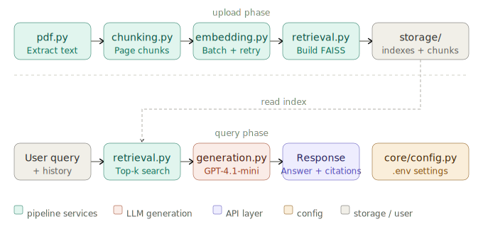

# DocuMind-AI: Full-Stack RAG for Intelligent Document QA


---

## 🚀 Quick Start

### Prerequisites

- Node.js (v16+)
- Python 3.8+
- OpenAI API Key

---

## ⚙️ Installation & Setup

### 1. Backend Setup

```bash
cd backend
python -m venv venv

# Windows
venv\Scripts\activate

# Mac/Linux
source venv/bin/activate

pip install -r requirements.txt
```

Create `.env` file inside `backend/`:

```env
OPENAI_API_KEY=your_api_key_here

# Models
EMBEDDING_MODEL=text-embedding-3-small
CHAT_MODEL=gpt-4.1-mini

# RAG settings
CHUNK_SIZE=500
RETRIEVAL_TOP_K=3
MAX_HISTORY_TURNS=10

# Storage
STORAGE_BASE=storage
```

Start backend server:

```bash
uvicorn main:app --reload --port 8000
```

---

### 2. Frontend Setup

```bash
cd frontend
npm install
npm run dev
```

---

## 🧪 Running Tests

```bash
cd backend
pytest tests/ -v
```

---

## 📁 Project Structure

```
DocuMind-AI/
├── backend/
│   ├── main.py                  # FastAPI app entry point
│   ├── core/
│   │   └── config.py            # Centralized config via .env
│   ├── routes/
│   │   └── upload.py            # API endpoints
│   ├── services/
│   │   ├── chunking.py          # Page-aware text chunking
│   │   ├── embedding.py         # Batch embeddings with retry logic
│   │   ├── retrieval.py         # FAISS vector store + search
│   │   ├── generation.py        # LLM answer + citations
│   │   ├── rag.py               # Compatibility shim
│   │   ├── pdf.py               # Multi-format text extraction
│   │   └── llm.py               # OpenAI client helpers
│   ├── tests/
│   │   ├── test_chunking.py
│   │   ├── test_embedding.py
│   │   └── test_retrieval.py
│   ├── storage/                 # FAISS indexes + chunk JSON
│   └── requirements.txt

└── frontend/
    ├── src/
    │   ├── components/          # React components
    │   ├── App.jsx
    │   └── index.css
    ├── package.json
    └── vite.config.js
```

---

## 🏗️ System Architecture (RAG Pipeline)

This system follows a Retrieval-Augmented Generation (RAG) architecture to ensure responses are grounded in document context and reduce hallucinations.



### Pipeline

1. User uploads a document
2. Backend extracts text and splits it into page-aware chunks (`chunking.py`)
3. Chunks are embedded in batches using OpenAI `text-embedding-3-small`
4. Embeddings are stored in a FAISS index per document (`retrieval.py`)
5. User question is embedded and top-k chunks are retrieved
6. Retrieved chunks are passed to GPT-4.1-mini (`generation.py`)
7. Final answer is returned with citations

---

## ✨ Features

- 📄 Multi-format Upload (PDF, DOCX, PPTX, TXT)
- 🤖 RAG-based AI Q&A system
- 📚 Multi-document support
- 🔖 Source citations (page + snippet)
- 💬 Chat history export (Markdown / JSON / TXT)
- 🧠 Conversation memory (session-based)
- 🗂️ Document management (list, delete, rename)
- 🎨 Modern UI with animations
- 📱 Fully responsive design
- ⚡ Batch embeddings with retry logic
- 🧪 Unit-tested core modules
- ⚙️ Config-driven architecture

---

## 🛠️ Tech Stack

**Frontend:** React 18, Vite, Framer Motion, Lucide Icons  
**Backend:** FastAPI, OpenAI GPT-4.1-mini, FAISS, pypdf, python-docx, python-pptx  
**Testing:** pytest  

---

## 📂 Supported File Types

| Format | Extensions |
|--------|------------|
| PDF | `.pdf` |
| Word | `.docx`, `.doc` |
| PowerPoint | `.pptx`, `.ppt` |
| Text | `.txt`, `.md` |

---

## 📝 License

MIT License — free to use and modify.
