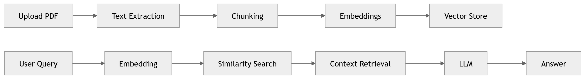

# DocuMind-AI: Full-Stack RAG for Intelligent Document QA


## 🚀 Quick Start

### Prerequisites

- Node.js (v16+)
- Python 3.8+
- OpenAI API Key

### Installation & Setup

1. **Backend Setup**

```bash
cd backend
pip install -r requirements.txt
```

Create `.env` file in the backend directory and add your OpenAI API key:

```
OPENAI_API_KEY=your_api_key_here
```

Start the server:

```bash
uvicorn main:app --reload --port 8000
```

2. **Frontend Setup**

```bash
cd frontend
npm install
npm run dev
```

---

## 📁 Project Structure

```
DocuMind-AI/
├── backend/                 # FastAPI Backend
│   ├── main.py             # Main application
│   ├── routes/             # API routes
│   ├── services/           # Business logic
│   ├── storage/            # Vector database storage
│   └── requirements.txt    # Python dependencies
│
└── frontend/               # React Frontend
    ├── src/
    │   ├── components/     # React components
    │   ├── App.jsx         # Main app component
    │   └── index.css       # Global styles
    ├── package.json
    └── vite.config.js
```

---

## 🏗️ System Architecture (RAG Pipeline)

> This system follows a Retrieval-Augmented Generation (RAG) architecture to ensure responses are grounded in document context and reduce hallucinations.



**Pipeline:**

1. User uploads a document
2. Backend extracts text and splits it into page-aware chunks
3. Each chunk is embedded using OpenAI `text-embedding-3-small`
4. Embeddings are stored in a per-document FAISS index
5. On each question, the query is embedded and top-k relevant chunks are retrieved
6. Retrieved chunks are passed as context to GPT-4.1-mini with inline citation instructions
7. Answer and source citations are returned to the frontend

---

## ✨ Features

- 📄 **Multi-format Upload** — PDF, Word, PowerPoint, and plain text with drag-and-drop
- 🤖 **AI-powered Q&A** — Answers grounded in your document using RAG
- 📚 **Multi-document Support** — Query across multiple uploaded documents simultaneously
- 🔖 **Source Citations** — Every answer shows the source file, page number, and snippet
- 💬 **Export Chat History** — Download conversations as Markdown, JSON, or plain text
- 🗂️ **Document Management** — List, rename, and delete uploaded documents
- 🎨 **Modern UI** — Dark gradient design with smooth Framer Motion animations
- 📱 **Fully Responsive** — Works on desktop and mobile
- ⚡ **Fast Vector Search** — FAISS flat L2 index for low-latency retrieval

---

## 🛠️ Tech Stack

**Frontend:** React 18, Vite, Framer Motion, Lucide Icons

**Backend:** FastAPI, OpenAI GPT-4.1-mini, FAISS, pypdf, python-docx, python-pptx

---

## 📂 Supported File Types

| Format | Extensions |
|---|---|
| PDF | `.pdf` |
| Word Document | `.docx`, `.doc` |
| PowerPoint | `.pptx`, `.ppt` |
| Plain Text / Markdown | `.txt`, `.md` |

---

## 📝 License

MIT License — feel free to use this project!
